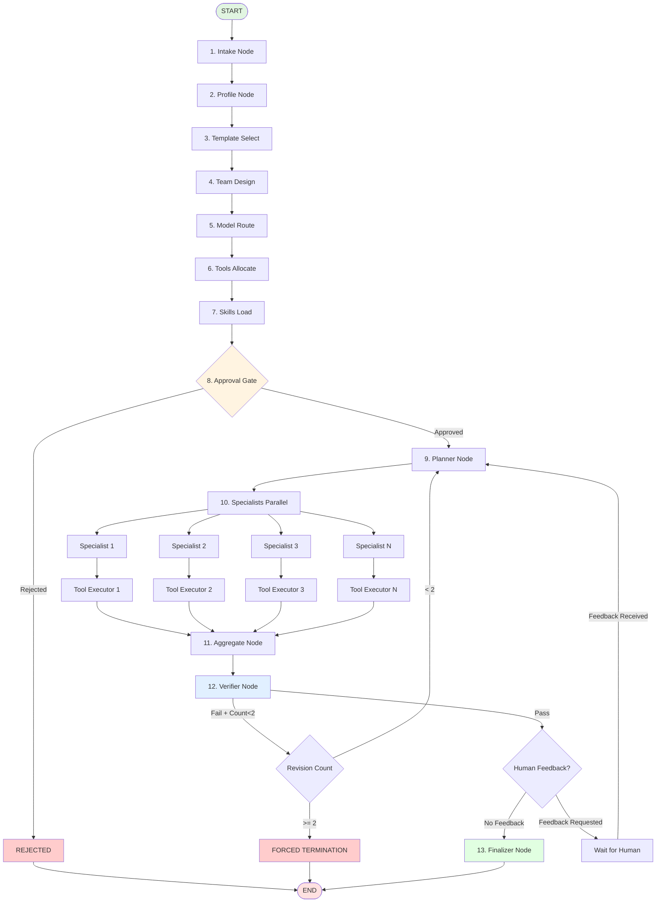

# LangGraph Execution Model | نموذج تنفيذ LangGraph

<div dir="rtl">

## مقدمة

LangGraph هو محرك تنفيذ الوكلاء الأساسي في المنصة. يوفر رسم بياني ثابت للتنفيذ (State Machine) مع إمكانية حفظ النقاط (Checkpointing) والاستئناف (Resume) والتنفيذ المتوازي.

</div>

---

## Execution Graph

### Complete Flow Diagram



---

## Node Definitions

### 1. Intake Node

<div dir="rtl">

**الهدف**: استقبال وتحليل طلب المهمة

</div>

```typescript
interface IntakeNode {
  input: {
    task_request: TaskRequest;
  };

  process(): {
    // Validate request structure
    validateRequest(task_request): ValidationResult;

    // Extract key information
    extractIntent(task_request): Intent;
    extractConstraints(task_request): Constraints;

    // Initial classification
    classifyComplexity(): 'simple' | 'medium' | 'complex';
    classifyDomain(): Domain[];
  };

  output: {
    validated_request: ValidatedTaskRequest;
    initial_classification: Classification;
  };

  // Write to state
  stateUpdates: {
    task_request: ValidatedTaskRequest;
    metadata: {
      complexity: string;
      domains: string[];
      timestamp: Date;
    };
  };
}
```

**Example Input**:
```json
{
  "task": "Research and write a technical blog post about LangGraph",
  "requirements": {
    "length": "2000 words",
    "tone": "technical but accessible",
    "include_code_examples": true
  },
  "constraints": {
    "deadline": "2024-03-01",
    "max_cost": null  // No cost constraint (quality-first)
  }
}
```

**Example Output**:
```json
{
  "validated_request": { /* ... */ },
  "initial_classification": {
    "complexity": "medium",
    "domains": ["research", "content", "coding"],
    "estimated_roles": ["researcher", "writer", "coder", "reviewer"]
  }
}
```

---

### 2. Profile Node

<div dir="rtl">

**الهدف**: تحليل متطلبات المهمة بعمق

</div>

```typescript
interface ProfileNode {
  input: {
    validated_request: ValidatedTaskRequest;
    initial_classification: Classification;
  };

  process(): {
    // Deep analysis
    analyzeRequirements(): DetailedRequirements;
    identifyCapabilities(): RequiredCapability[];
    estimateResources(): ResourceEstimate;

    // Risk assessment
    assessRisks(): Risk[];
    identifySensitiveAspects(): SensitiveAspect[];
  };

  output: {
    task_profile: TaskProfile;
  };

  stateUpdates: {
    task_profile: TaskProfile;
  };
}
```

**TaskProfile Structure**:
```typescript
interface TaskProfile {
  id: string;
  task_type: 'research' | 'coding' | 'content' | 'data' | 'mixed';
  complexity_score: number;  // 0-100
  required_capabilities: Capability[];
  estimated_duration: number;  // minutes
  required_tools: string[];
  required_skills: string[];
  risks: Risk[];
  sensitive_data_handling: boolean;
  human_oversight_recommended: boolean;
}
```

---

### 3. Template Select Node

<div dir="rtl">

**الهدف**: اختيار القالب المناسب للفريق

</div>

```typescript
interface TemplateSelectNode {
  input: {
    task_profile: TaskProfile;
  };

  process(): {
    // Query template database
    queryTemplates(profile: TaskProfile): TeamTemplate[];

    // Score templates
    scoreTemplate(template: TeamTemplate, profile: TaskProfile): number;

    // Select best match
    selectBestTemplate(): TeamTemplate;
  };

  output: {
    selected_template: TeamTemplate;
    template_match_score: number;
  };

  stateUpdates: {
    selected_template: TeamTemplate;
  };
}
```

**Template Structure**:
```yaml
# Example: Research Team Template
id: research-team-v1
name: Research & Analysis Team
category: research
roles:
  - id: lead_researcher
    name: Lead Researcher
    capabilities: [research, synthesis, critical_thinking]
    model_requirements:
      reasoning: high
      knowledge: high

  - id: fact_checker
    name: Fact Checker
    capabilities: [verification, source_evaluation]

  - id: synthesizer
    name: Synthesizer
    capabilities: [writing, organization]

tools:
  - tavily_search
  - web_scraper
  - citation_manager

skills:
  - research_methodology
  - source_evaluation
  - synthesis
```

---

### 4. Team Design Node

<div dir="rtl">

**الهدف**: تصميم تكوين الفريق النهائي

</div>

```typescript
interface TeamDesignNode {
  input: {
    task_profile: TaskProfile;
    selected_template: TeamTemplate;
  };

  process(): {
    // Customize template
    instantiateRoles(template: TeamTemplate): Role[];

    // Add specialized roles if needed
    addSpecializedRoles(profile: TaskProfile): Role[];

    // Ensure diversity
    enforceDiversity(roles: Role[]): void;

    // Create role assignments
    createAssignments(): RoleAssignment[];
  };

  output: {
    team_composition: RoleAssignment[];
  };

  stateUpdates: {
    team_composition: RoleAssignment[];
  };
}
```

**RoleAssignment Structure**:
```typescript
interface RoleAssignment {
  role_id: string;
  role_name: string;
  responsibilities: string[];
  required_capabilities: Capability[];
  collaboration_with: string[];  // Other role IDs
  output_format: string;

  // Will be filled by Model Route node
  assigned_model?: ModelDecision;
}
```

---

### 5. Model Route Node

<div dir="rtl">

**الهدف**: اختيار أفضل نموذج لكل دور

</div>

```typescript
interface ModelRouteNode {
  input: {
    team_composition: RoleAssignment[];
    task_profile: TaskProfile;
  };

  process(): {
    // For each role
    for (const role of team_composition) {
      // Get available models
      const candidates = getEligibleModels(role);

      // Score each model (QUALITY-FIRST)
      const scores = candidates.map(model => ({
        model,
        score: scoreModel(model, role)
      }));

      // Select best model
      const selected = selectBestModel(scores);

      // Assign fallback chain
      const fallbacks = createFallbackChain(selected, candidates);

      assignments.push({
        role,
        model: selected,
        fallbacks
      });
    }

    // Enforce diversity (minimum 2 different models)
    enforceDiversity(assignments);
  };

  output: {
    model_assignments: ModelDecision[];
  };

  stateUpdates: {
    model_assignments: ModelDecision[];
  };
}
```

**Scoring Formula** (Quality-First):
```typescript
function scoreModel(model: ModelProfile, role: RoleAssignment): number {
  // Cost is NEVER a factor
  const quality_score = model.capability_scores[role.primary_capability] * 0.65;
  const tool_reliability = model.tool_calling_success_rate * 0.20;
  const capability_fit = calculateCapabilityFit(model, role) * 0.10;
  const latency_reliability = (1 - model.latency_variance) * 0.05;

  return quality_score + tool_reliability + capability_fit + latency_reliability;
}
```

**Diversity Enforcement**:
```typescript
function enforceDiversity(assignments: ModelDecision[]): void {
  const uniqueModels = new Set(assignments.map(a => a.model_id));

  if (uniqueModels.size < 2) {
    throw new Error('MINIMUM_DIVERSITY_VIOLATION: Team must use at least 2 different models');
  }
}
```

---

### 6. Tools Allocate Node

<div dir="rtl">

**الهدف**: تخصيص الأدوات لكل دور

</div>

```typescript
interface ToolsAllocateNode {
  input: {
    team_composition: RoleAssignment[];
    task_profile: TaskProfile;
  };

  process(): {
    // Get required tools from profile
    const required = task_profile.required_tools;

    // Query MCP servers
    const mcpTools = await mcpBroker.listTools();

    // Match tools to roles
    const allocations = roles.map(role => ({
      role_id: role.id,
      tools: matchToolsToRole(role, mcpTools, required),
      policies: createToolPolicies(role)
    }));

    // Identify sensitive tools
    markSensitiveTools(allocations);
  };

  output: {
    tool_allocations: ToolPolicy[];
  };

  stateUpdates: {
    tool_allocations: ToolPolicy[];
  };
}
```

**ToolPolicy Structure**:
```typescript
interface ToolPolicy {
  role_id: string;
  allowed_tools: ToolDescriptor[];
  sensitive_tools: ToolDescriptor[];  // Require approval
  tool_restrictions: {
    max_calls_per_tool: number;
    timeout_seconds: number;
    require_approval: boolean;
  };
}
```

---

### 7. Skills Load Node

<div dir="rtl">

**الهدف**: تحميل المهارات المطلوبة

</div>

```typescript
interface SkillsLoadNode {
  input: {
    team_composition: RoleAssignment[];
    task_profile: TaskProfile;
  };

  process(): {
    // Progressive disclosure: metadata only initially
    const metadata = await skillsEngine.listSkills({
      categories: task_profile.domains,
      tags: task_profile.required_skills
    });

    // Select relevant skills
    const selected = selectRelevantSkills(metadata, task_profile);

    // Load full content for activated skills
    const activated = await Promise.all(
      selected.map(s => skillsEngine.activateSkill(s.id))
    );

    // Assign to roles
    const assignments = assignSkillsToRoles(activated, team_composition);
  };

  output: {
    activated_skills: SkillActivation[];
  };

  stateUpdates: {
    activated_skills: SkillActivation[];
  };
}
```

**SkillActivation Structure**:
```typescript
interface SkillActivation {
  skill_id: string;
  skill_name: string;
  category: SkillCategory;
  assigned_to_roles: string[];
  content: string;  // Full SKILL.md loaded
  requires_tools: string[];
  dependencies: string[];
  activated_at: Date;
}
```

---

### 8. Approval Gate Node

<div dir="rtl">

**الهدف**: بوابة الموافقة البشرية (HITL)

</div>

```typescript
interface ApprovalGateNode {
  input: {
    team_composition: RoleAssignment[];
    model_assignments: ModelDecision[];
    tool_allocations: ToolPolicy[];
    activated_skills: SkillActivation[];
  };

  process(): {
    // Check if approval required
    const requiresApproval =
      hasSensitiveTools(tool_allocations) ||
      task_profile.human_oversight_recommended ||
      user_preferences.require_approval;

    if (requiresApproval && mode === 'approval') {
      // LangGraph interrupt - wait for human
      return interrupt({
        type: 'approval_request',
        data: {
          team_draft: createDraft(),
          estimated_cost: null,  // No cost tracking
          risks: task_profile.risks
        }
      });
    }

    // Auto-approve in auto mode
    if (mode === 'auto') {
      return { approved: true };
    }
  };

  output: {
    approval_status: 'approved' | 'rejected' | 'pending';
    approval_notes?: string;
  };

  stateUpdates: {
    approval_status: string;
  };
}
```

**LangGraph Interrupt**:
```typescript
// Using LangGraph's interrupt mechanism
const graph = new StateGraph({
  // ... node definitions
});

graph.addNode('approval_gate', async (state) => {
  if (requiresApproval) {
    // This pauses execution
    return interrupt({
      value: state,
      resumable: true
    });
  }
  return state;
});

// Resume later
await graph.resume(checkpointId, {
  approval_status: 'approved',
  approval_notes: 'Looks good, proceed'
});
```

---

### 9. Planner Node

<div dir="rtl">

**الهدف**: إنشاء خطة تنفيذ مفصلة

</div>

```typescript
interface PlannerNode {
  input: {
    task_request: TaskRequest;
    task_profile: TaskProfile;
    team_composition: RoleAssignment[];
    model_assignments: ModelDecision[];
  };

  process(): {
    // Call lead model (highest quality) to create plan
    const leadModel = selectLeadModel(model_assignments);

    const plan = await leadModel.generate({
      system: PLANNER_SYSTEM_PROMPT,
      user: createPlanningPrompt(task_request, team_composition),
      tools: ['create_step', 'assign_step', 'set_dependencies']
    });

    // Parse and validate plan
    const parsed = parsePlan(plan);
    validatePlan(parsed);

    return parsed;
  };

  output: {
    execution_plan: ExecutionPlan;
  };

  stateUpdates: {
    execution_plan: ExecutionPlan;
  };
}
```

**ExecutionPlan Structure**:
```typescript
interface ExecutionPlan {
  steps: PlanStep[];
  dependencies: Map<string, string[]>;  // step_id -> depends_on[]
  parallel_groups: string[][];  // Steps that can run in parallel
  estimated_duration: number;
}

interface PlanStep {
  step_id: string;
  description: string;
  assigned_role: string;
  inputs: object;
  expected_output: string;
  tools_needed: string[];
  skills_used: string[];
}
```

---

### 10. Specialists Parallel Node

<div dir="rtl">

**الهدف**: تنفيذ متوازي للمتخصصين

</div>

```typescript
interface SpecialistsParallelNode {
  input: {
    execution_plan: ExecutionPlan;
    team_composition: RoleAssignment[];
    model_assignments: ModelDecision[];
  };

  process(): {
    // Group steps by dependencies
    const groups = createParallelGroups(execution_plan);

    // Execute groups sequentially, steps within group in parallel
    const results = [];
    for (const group of groups) {
      const groupResults = await Promise.all(
        group.map(step => executeSpecialist(step))
      );
      results.push(...groupResults);
    }

    return results;
  };

  output: {
    specialist_outputs: Map<string, SpecialistResult>;
  };

  stateUpdates: {
    specialist_outputs: Map<string, SpecialistResult>;
  };
}

async function executeSpecialist(step: PlanStep): Promise<SpecialistResult> {
  const role = getRoleAssignment(step.assigned_role);
  const model = getModelDecision(role.id);
  const tools = getToolsForRole(role.id);
  const skills = getSkillsForRole(role.id);

  // Build context
  const context = {
    role_description: role.responsibilities,
    skills_instructions: skills.map(s => s.content).join('\n\n'),
    available_tools: tools,
    step_instructions: step.description,
    inputs: step.inputs
  };

  // Execute with model
  const result = await model.execute(context);

  return {
    step_id: step.step_id,
    role_id: role.id,
    output: result.content,
    tool_calls: result.tool_calls,
    tokens_used: result.usage,
    duration_ms: result.duration
  };
}
```

---

### 11. Tool Executor Node

<div dir="rtl">

**الهدف**: تنفيذ جميع استدعاءات الأدوات

</div>

```typescript
interface ToolExecutorNode {
  input: {
    specialist_outputs: Map<string, SpecialistResult>;
  };

  process(): {
    // Extract all tool calls
    const allToolCalls = extractToolCalls(specialist_outputs);

    // Execute each tool call through broker
    const results = await Promise.all(
      allToolCalls.map(call => executeTool(call))
    );

    // Update specialist outputs with tool results
    mergeToolResults(specialist_outputs, results);
  };

  output: {
    tool_execution_results: ToolExecutionTrace[];
    updated_specialist_outputs: Map<string, SpecialistResult>;
  };

  stateUpdates: {
    specialist_outputs: Map<string, SpecialistResult>;
    tool_execution_trace: ToolExecutionTrace[];
  };
}

async function executeTool(call: ToolCall): Promise<ToolResult> {
  // Check if sensitive
  if (toolBroker.isSensitive(call.tool_name)) {
    // Request approval via interrupt
    const approval = await requestToolApproval(call);
    if (!approval.approved) {
      return { error: 'Tool execution rejected by user' };
    }
  }

  // Execute through broker (MCP priority)
  const result = await toolBroker.execute(call);

  // Audit log
  await auditLogger.log({
    action: 'tool_execution',
    tool: call.tool_name,
    arguments: call.arguments,
    result: result.summary,
    duration_ms: result.duration
  });

  return result;
}
```

**Tool Execution Priority**:
1. MCP Tools (if available)
2. Provider-Native Tools (function calling)
3. Local Sandbox Tools (E2B)

---

### 12. Aggregate Node

<div dir="rtl">

**الهدف**: دمج نتائج المتخصصين

</div>

```typescript
interface AggregateNode {
  input: {
    specialist_outputs: Map<string, SpecialistResult>;
    execution_plan: ExecutionPlan;
  };

  process(): {
    // Order outputs by plan steps
    const ordered = orderByPlan(specialist_outputs, execution_plan);

    // Combine outputs
    const combined = combineOutputs(ordered);

    // Create structured result
    const aggregated = {
      main_result: combined.primary,
      supporting_data: combined.secondary,
      artifacts: extractArtifacts(specialist_outputs),
      metadata: {
        total_steps: execution_plan.steps.length,
        completed_steps: specialist_outputs.size,
        total_tokens: sumTokens(specialist_outputs),
        total_duration_ms: sumDuration(specialist_outputs)
      }
    };

    return aggregated;
  };

  output: {
    aggregated_result: AggregatedResult;
  };

  stateUpdates: {
    aggregated_result: AggregatedResult;
  };
}
```

---

### 13. Verifier Node

<div dir="rtl">

**الهدف**: التحقق من جودة النتيجة

</div>

```typescript
interface VerifierNode {
  input: {
    task_request: TaskRequest;
    task_profile: TaskProfile;
    aggregated_result: AggregatedResult;
    revision_count: number;
  };

  process(): {
    // Use high-quality model for verification
    const verifierModel = selectBestModel({ capability: 'reasoning' });

    const verification = await verifierModel.verify({
      original_request: task_request,
      result: aggregated_result,
      criteria: createVerificationCriteria(task_profile)
    });

    // Decision logic
    if (verification.passed) {
      return { status: 'pass', proceed_to: 'finalizer' };
    }

    if (revision_count >= 2) {
      return {
        status: 'forced_termination',
        reason: 'Maximum revision loops (2) reached',
        proceed_to: 'finalizer'  // Force proceed with warning
      };
    }

    return {
      status: 'revise',
      feedback: verification.issues,
      proceed_to: 'planner'  // Loop back
    };
  };

  output: {
    verification_result: VerificationResult;
  };

  stateUpdates: {
    verification_result: VerificationResult;
    revision_count: number;  // Increment if revising
  };
}
```

**Verification Criteria**:
```typescript
interface VerificationCriteria {
  completeness: {
    all_requirements_met: boolean;
    missing_elements: string[];
  };
  accuracy: {
    factual_correctness: number;  // 0-100
    issues: string[];
  };
  quality: {
    clarity: number;
    coherence: number;
    professionalism: number;
  };
  constraints: {
    length_met: boolean;
    format_correct: boolean;
    deadline_feasible: boolean;
  };
}
```

**Revision Loop Protection**:
```typescript
// HARD LIMIT: Maximum 2 revision loops
if (revision_count >= 2) {
  console.warn('FORCED_TERMINATION: Maximum revision loops reached');
  auditLogger.log({
    event: 'forced_termination',
    reason: 'max_revision_loops',
    run_id: state.run_id
  });
  // Proceed to finalizer with warning flag
  return { proceed_to: 'finalizer', warning: 'forced_completion' };
}
```

---

### 14. Human Feedback Node (Optional)

<div dir="rtl">

**الهدف**: جمع ملاحظات بشرية قبل الإنهاء

</div>

```typescript
interface HumanFeedbackNode {
  input: {
    aggregated_result: AggregatedResult;
    verification_result: VerificationResult;
  };

  process(): {
    // Check if feedback requested
    if (!user_preferences.request_feedback_before_finalize) {
      return { skip: true };
    }

    // LangGraph interrupt for feedback
    return interrupt({
      type: 'feedback_request',
      data: {
        result_preview: aggregated_result.main_result.slice(0, 500),
        verification_status: verification_result.status,
        options: ['accept', 'revise', 'reject']
      }
    });
  };

  output: {
    human_feedback?: HumanFeedback;
  };

  stateUpdates: {
    human_feedback?: HumanFeedback;
  };
}
```

---

### 15. Finalizer Node

<div dir="rtl">

**الهدف**: إنهاء التنفيذ وإرجاع النتيجة النهائية

</div>

```typescript
interface FinalizerNode {
  input: {
    task_request: TaskRequest;
    aggregated_result: AggregatedResult;
    verification_result: VerificationResult;
    human_feedback?: HumanFeedback;
  };

  process(): {
    // Format final output
    const final_output = formatOutput(
      aggregated_result,
      task_request.output_format
    );

    // Save artifacts
    const artifacts = await saveArtifacts(aggregated_result.artifacts);

    // Create metadata
    const metadata = createMetadata(state);

    // Mark run as complete
    await markRunComplete(state.run_id);

    return {
      final_output,
      artifacts,
      metadata
    };
  };

  output: {
    final_result: FinalResult;
  };

  stateUpdates: {
    final_output: FinalResult;
    run_status: 'completed';
  };
}
```

**FinalResult Structure**:
```typescript
interface FinalResult {
  content: string;
  format: 'text' | 'markdown' | 'html' | 'json';
  artifacts: Artifact[];
  metadata: {
    run_id: string;
    started_at: Date;
    completed_at: Date;
    total_duration_ms: number;
    team_size: number;
    models_used: string[];
    tools_used: string[];
    skills_activated: string[];
    total_tokens: number;
    verification_status: string;
    revision_count: number;
  };
  warnings?: string[];
}
```

---

## State Management

### Complete State Schema

```typescript
interface RunState {
  // Metadata
  run_id: string;
  user_id: string;
  created_at: Date;
  updated_at: Date;

  // Node outputs (append-only)
  task_request: TaskRequest;
  task_profile: TaskProfile;
  selected_template: TeamTemplate;
  team_composition: RoleAssignment[];
  model_assignments: ModelDecision[];
  tool_allocations: ToolPolicy[];
  activated_skills: SkillActivation[];
  approval_status: 'pending' | 'approved' | 'rejected';
  execution_plan: ExecutionPlan;
  specialist_outputs: Map<string, SpecialistResult>;
  tool_execution_trace: ToolExecutionTrace[];
  aggregated_result: AggregatedResult;
  verification_result: VerificationResult;
  human_feedback?: HumanFeedback;
  final_output?: FinalResult;

  // Control flow
  current_node: string;
  revision_count: number;  // MAX 2
  run_status: 'pending' | 'running' | 'paused' | 'completed' | 'failed';

  // Error handling
  errors: Error[];
  retry_count: number;
}
```

**State Rules**:
1. **JSON Serializable**: No class instances, no functions
2. **Append-Only**: Never delete, only add/update
3. **Node Isolation**: Each node writes only its designated keys
4. **Immutability**: Use spread operator for updates

---

## Checkpointing & Resume

### Checkpoint Strategy

```typescript
// Checkpoint after EVERY node execution
graph.addNode('some_node', async (state) => {
  const result = await processNode(state);

  // Automatic checkpoint by LangGraph
  // Saved to PostgreSQL (run_checkpoints table)

  return { ...state, ...result };
});
```

**Checkpoint Storage**:
```sql
CREATE TABLE run_checkpoints (
  checkpoint_id UUID PRIMARY KEY,
  run_id UUID NOT NULL,
  node_name VARCHAR(100) NOT NULL,
  state JSONB NOT NULL,
  created_at TIMESTAMP DEFAULT NOW(),

  INDEX idx_run_checkpoints_run_id (run_id),
  INDEX idx_run_checkpoints_created_at (created_at)
);
```

### Resume Capability

```typescript
// Resume from checkpoint
async function resumeRun(run_id: string): Promise<FinalResult> {
  // Load latest checkpoint
  const checkpoint = await loadCheckpoint(run_id);

  // Continue execution from checkpoint
  const result = await graph.invoke(checkpoint.state, {
    checkpoint_id: checkpoint.checkpoint_id
  });

  return result.final_output;
}

// Resume with user input (after interrupt)
async function resumeWithInput(
  run_id: string,
  user_input: object
): Promise<FinalResult> {
  const checkpoint = await loadCheckpoint(run_id);

  // Merge user input into state
  const updated_state = {
    ...checkpoint.state,
    ...user_input
  };

  const result = await graph.invoke(updated_state, {
    checkpoint_id: checkpoint.checkpoint_id
  });

  return result.final_output;
}
```

---

## Error Handling

### Retry Strategy

```typescript
// Automatic retries with exponential backoff
const retryConfig = {
  maxAttempts: 3,
  baseDelay: 1000,  // 1s, 2s, 4s
  maxDelay: 10000,
  retryableErrors: [
    'RATE_LIMIT_ERROR',
    'TIMEOUT_ERROR',
    'NETWORK_ERROR',
    'MODEL_OVERLOADED'
  ]
};

graph.addNode('some_node', async (state) => {
  return retry(
    async () => {
      return await processNode(state);
    },
    retryConfig
  );
});
```

### Fallback Chains

```typescript
// Model fallback chain
async function executeWithFallback(
  primary: ModelDecision,
  fallbacks: ModelDecision[],
  prompt: Prompt
): Promise<ModelResult> {
  const chain = [primary, ...fallbacks];

  for (const model of chain) {
    try {
      return await model.execute(prompt);
    } catch (error) {
      console.warn(`Model ${model.model_id} failed, trying fallback`);
      if (model === chain[chain.length - 1]) {
        throw new Error('All models in fallback chain failed');
      }
    }
  }
}
```

---

## Performance Optimizations

### Parallel Execution

```typescript
// Specialists execute in parallel when no dependencies
const parallelGroups = [
  ['researcher_1', 'researcher_2', 'researcher_3'],  // Group 1: parallel
  ['synthesizer'],                                    // Group 2: sequential
  ['reviewer']                                        // Group 3: sequential
];

for (const group of parallelGroups) {
  await Promise.all(
    group.map(role_id => executeSpecialist(role_id))
  );
}
```

### Caching

```typescript
// Semantic cache for expensive operations
async function executeWithCache(prompt: string): Promise<Result> {
  // Check cache
  const cached = await semanticCache.findSimilar(prompt, 0.95);
  if (cached) {
    console.log('Cache hit (semantic)');
    return cached.result;
  }

  // Execute
  const result = await model.execute(prompt);

  // Store in cache
  await semanticCache.store(prompt, result, 3600);

  return result;
}
```

---

## Monitoring & Observability

### LangSmith Integration

```typescript
// Automatic tracing
import { traceable } from 'langsmith/traceable';

const executeNode = traceable(
  async (state: RunState) => {
    // ... node logic
  },
  {
    name: 'node_name',
    run_type: 'chain'
  }
);
```

**Tracked Metrics**:
- ✅ Execution time per node
- ✅ Token usage per model call
- ✅ Error rate and types
- ✅ Cache hit rate
- ✅ Tool execution success rate
- ✅ Full state transitions

---

## Best Practices

<div dir="rtl">

### القواعد الذهبية

1. **لا تخطي العقد**: تنفيذ الرسم البياني ثابت ومحدد
2. **Verifier قبل Finalizer دائماً**: لا استثناءات
3. **حد أقصى 2 تكرارات**: حماية من الحلقات اللانهائية
4. **جميع الأدوات عبر tool_executor**: لا تنفيذ مباشر
5. **State يجب أن يكون JSON**: لا class instances
6. **Checkpoint بعد كل عقدة**: إمكانية الاستئناف
7. **استخدم Fallbacks**: دائماً خطة احتياطية

</div>

---

## Next Steps

- [Tool Execution Details](TOOL_EXECUTION.md)
- [Model Routing Strategy](MODEL_ROUTING.md)
- [Skills System](SKILLS_SYSTEM.md)
- [Data Flow](DATA_FLOW.md)

---

<div align="center" dir="rtl">

**LangGraph: محرك تنفيذ موثوق، قابل للاستئناف، قابل للتوسع**

</div>
