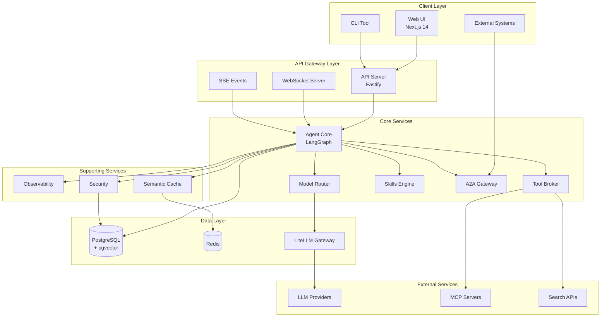
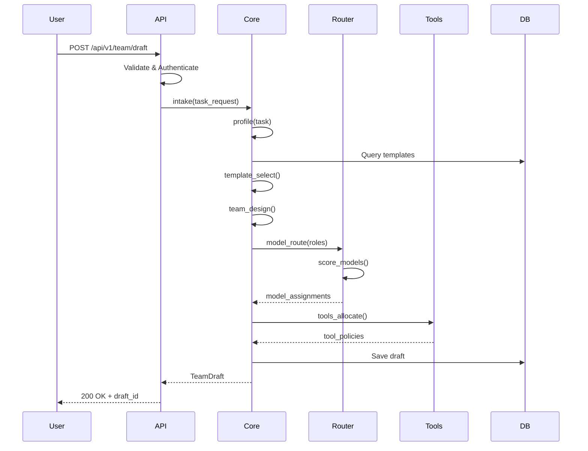
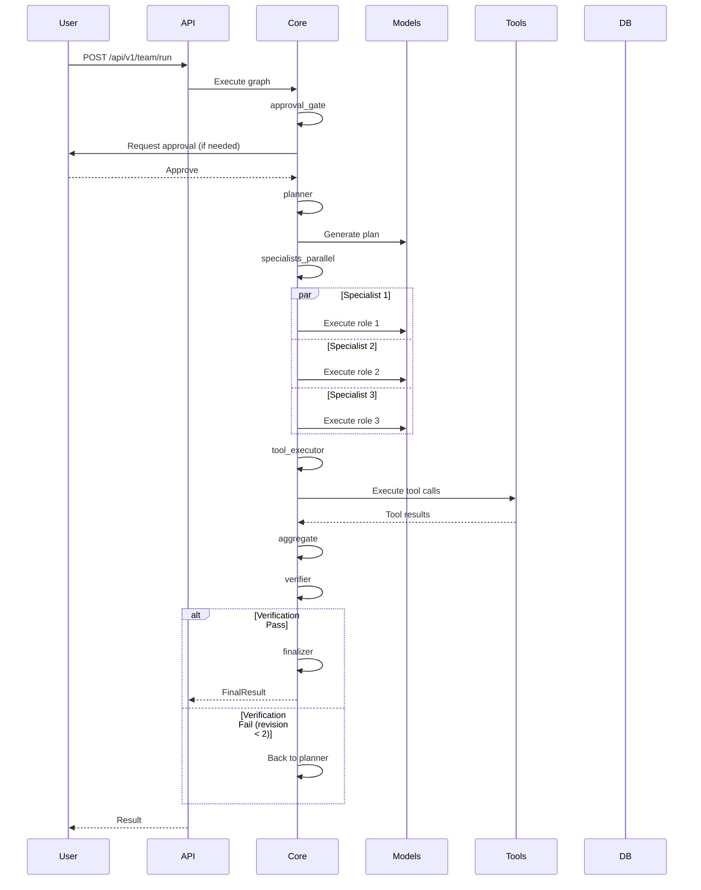
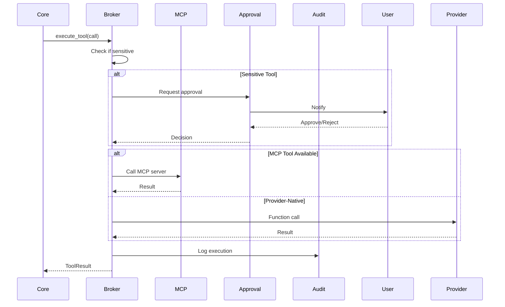

# نظرة عامة على المعمارية | Architecture Overview

<div dir="rtl">

## مقدمة

منصة فرق الوكلاء متعددة النماذج هي نظام موزع مبني على معمارية Microservices، مصمم لتنظيم وتنفيذ فرق الوكلاء الذكية بشكل تلقائي. تعتمد المنصة على مجموعة من التقنيات المتقدمة لتحقيق الأداء العالي والقابلية للتوسع والأمان.

</div>

---

## System Architecture

### High-Level Overview



---

## <div dir="rtl">الطبقات الرئيسية | Core Layers</div>

### 1. Client Layer (طبقة العميل)

<div dir="rtl">

**المسؤولية**: واجهات المستخدم والتفاعل

</div>

#### Web UI (Next.js 14)
- **Technology**: React 18 + App Router + Server Components
- **Features**:
  - Team builder with drag-and-drop
  - Real-time workflow visualization
  - Multi-turn conversation interface
  - Artifact management
  - Template marketplace
- **Communication**: REST API, Server-Sent Events (SSE), WebSocket

#### CLI Tool
- **Purpose**: Command-line interface for automation
- **Use Cases**: CI/CD integration, scripting, batch operations

#### External Systems
- **Integration**: Slack, GitHub, Notion, Jira, Zapier
- **Protocol**: A2A (Agent-to-Agent) protocol

---

### 2. API Gateway Layer (طبقة البوابة)

<div dir="rtl">

**المسؤولية**: معالجة الطلبات، المصادقة، التوجيه

</div>

#### API Server (Fastify)
```typescript
// Main responsibilities:
- Request validation & sanitization
- Authentication & authorization (RBAC)
- Rate limiting & throttling
- Request/response logging
- Error handling & normalization
- API versioning (v1, v2)
```

**Endpoints**: 22+ REST endpoints
- Team lifecycle: `/api/v1/team/*`
- Run management: `/api/v1/runs/*`
- Models: `/api/v1/models/*`
- Templates: `/api/v1/templates/*`
- Skills: `/api/v1/skills/*`
- MCP: `/api/v1/mcp/*`
- A2A: `/api/v1/a2a/*`

#### WebSocket Server
- **Purpose**: Real-time bidirectional communication
- **Use Cases**:
  - Live run updates
  - Tool execution feedback
  - Human-in-the-loop interactions

#### Server-Sent Events (SSE)
- **Purpose**: Unidirectional streaming from server
- **Use Cases**:
  - Run event streams
  - Progress updates
  - Log streaming

---

### 3. Core Services Layer (طبقة الخدمات الأساسية)

#### 3.1 Agent Core (LangGraph)

<div dir="rtl">

**محرك التنفيذ الرئيسي** - يدير دورة حياة الوكلاء الكاملة

</div>

**Architecture Pattern**: State Machine with Checkpointing

```typescript
// LangGraph Execution Flow
type AgentGraph = {
  nodes: {
    intake: IntakeNode;
    profile: ProfileNode;
    template_select: TemplateSelectNode;
    team_design: TeamDesignNode;
    model_route: ModelRouteNode;
    tools_allocate: ToolsAllocateNode;
    skills_load: SkillsLoadNode;
    approval_gate: ApprovalGateNode;
    planner: PlannerNode;
    specialists_parallel: SpecialistsNode;
    tool_executor: ToolExecutorNode;
    aggregate: AggregateNode;
    verifier: VerifierNode;
    human_feedback: HumanFeedbackNode;
    finalizer: FinalizerNode;
  };
  edges: Edge[];
  checkpointer: PostgresCheckpointer;
};
```

**Key Features**:
- ✅ Deterministic execution flow
- ✅ Checkpoint persistence for resume capability
- ✅ Parallel specialist execution
- ✅ Automatic retry with exponential backoff
- ✅ Human-in-the-loop at approval gate
- ✅ Maximum 2 revision loops enforced

**State Management**:
```typescript
interface RunState {
  task_request: TaskRequest;
  task_profile: TaskProfile;
  selected_template: TeamTemplate;
  team_composition: RoleAssignment[];
  model_assignments: ModelDecision[];
  tool_allocations: ToolPolicy[];
  activated_skills: SkillActivation[];
  approval_status: 'pending' | 'approved' | 'rejected';
  execution_plan: ExecutionPlan;
  specialist_outputs: Map<string, SpecialistResult>;
  aggregated_result: AggregatedResult;
  verification_result: VerificationResult;
  revision_count: number; // max 2
  final_output: FinalResult;
}
```

---

#### 3.2 Model Router

<div dir="rtl">

**توجيه ذكي للنماذج** - يختار أفضل نموذج لكل دور بناءً على الجودة

</div>

**Selection Algorithm**:
```typescript
// Quality-first scoring (cost is NEVER a factor)
const score =
  quality_score * 0.65 +           // Model capability quality
  tool_reliability * 0.20 +        // Tool calling reliability
  capability_fit * 0.10 +          // Task-specific fit
  latency_reliability * 0.05;      // Response time consistency
```

**Key Constraints**:
- ✅ Minimum 2 different models per team
- ✅ No cost-based selection
- ✅ Fallback chains for each role
- ✅ Model diversity enforcement

**Supported Models** (via LiteLLM):
- OpenAI: GPT-4o, GPT-4-Turbo, GPT-3.5-Turbo
- Anthropic: Claude Opus 4.6, Claude Sonnet 4.5
- Google: Gemini 2.0 Flash, Gemini 1.5 Pro
- Cohere: Command R+
- Mistral: Large, Medium
- Open Source: Llama 3, Mixtral, Qwen

---

#### 3.3 Tool Broker

<div dir="rtl">

**إدارة الأدوات** - طبقة موحدة لجميع الأدوات

</div>

**Tool Priority**:
1. **MCP Tools** (Model Context Protocol) - First priority
2. **Provider-Native Tools** (Function calling)
3. **Local Sandbox Tools** (E2B, isolated runners)

**Features**:
```typescript
interface ToolBroker {
  // MCP client management
  registerMcpServer(config: McpServerConfig): void;
  listMcpTools(): McpToolDescriptor[];

  // Tool execution
  executeTool(call: ToolCall): ToolResult;

  // Semantic selection (Bigtool)
  selectRelevantTools(task: string, tools: Tool[]): Tool[];

  // Approval workflow
  requiresApproval(tool: Tool): boolean;
  requestApproval(call: ToolCall): ApprovalRequest;
}
```

**Supported MCP Servers**:
- GitHub, PostgreSQL, Filesystem
- Playwright (browser automation)
- Slack, Notion, Supabase
- Custom servers via stdio protocol

**Sensitive Tools** (require approval):
- Destructive database operations
- Git push/force-push
- File deletion
- External API calls with side effects

---

#### 3.4 Skills Engine

<div dir="rtl">

**نظام المهارات** - مكتبة قابلة للتوسع من المهارات

</div>

**Progressive Disclosure Pattern**:
```typescript
// Load only metadata initially
interface SkillMetadata {
  id: string;
  name: string;
  category: 'core' | 'shared' | 'coding' | 'research' | 'content' | 'data';
  tags: string[];
  requires_tools: string[];
  size_bytes: number;
}

// Load full skill only on activation
interface FullSkill extends SkillMetadata {
  content: string;        // Full SKILL.md
  instructions: string;
  examples: Example[];
  dependencies: string[];
}
```

**Skill Categories**:
- **Core**: Essential skills (problem analysis, planning, verification)
- **Shared**: Cross-domain (communication, error handling, documentation)
- **Coding**: Development skills (code review, debugging, testing)
- **Research**: Investigation (web search, data extraction, synthesis)
- **Content**: Creation (writing, editing, formatting)
- **Data**: Analysis (transformation, visualization, ML)

**Storage**:
- Metadata: PostgreSQL (always loaded)
- Full content: Loaded on-demand, cached in Redis

---

#### 3.5 A2A Gateway

<div dir="rtl">

**بوابة Agent-to-Agent** - للتفاعل بين الوكلاء

</div>

**Protocol**: Google's A2A (Agent-to-Agent) standard

```typescript
// Agent Card (self-description)
interface AgentCard {
  id: string;
  name: string;
  description: string;
  capabilities: Capability[];
  tools: ToolDescriptor[];
  skills: string[];
  endpoints: {
    task: string;      // POST /api/v1/a2a/tasks
    status: string;    // GET /api/v1/a2a/tasks/:id
    cancel: string;    // POST /api/v1/a2a/tasks/:id/cancel
  };
  authentication: AuthMethod;
}

// Task delegation
interface A2ATaskRequest {
  from_agent: string;
  to_agent: string;
  task: TaskDescription;
  context: Context;
  timeout_ms: number;
}
```

**Use Cases**:
- Hierarchical agent orchestration
- Cross-platform agent collaboration
- Federation with external agents

---

### 4. Supporting Services Layer

#### 4.1 Observability

<div dir="rtl">

**مراقبة شاملة** - تتبع وتسجيل كامل

</div>

**Components**:

1. **LangSmith Integration** (Native)
```typescript
// Automatic tracing
- Run tracking with full state
- Token usage per model call
- Latency per node
- Error tracking and categorization
```

2. **OpenTelemetry** (Distributed Tracing)
```typescript
// Spans across services
- HTTP requests
- Database queries
- Redis operations
- Tool executions
- Model calls
```

3. **Audit Logging**
```typescript
interface AuditEvent {
  event_id: string;
  timestamp: Date;
  actor_id: string;
  action: 'create' | 'update' | 'delete' | 'approve' | 'execute';
  resource_type: string;
  resource_id: string;
  before_state?: object;
  after_state?: object;
  ip_address: string;
  user_agent: string;
}
```

**Metrics**:
- Request rate, latency, errors
- Model usage per provider
- Tool execution success rate
- Cache hit rate
- Queue depth and processing time

---

#### 4.2 Security

<div dir="rtl">

**أمان متعدد الطبقات**

</div>

**Components**:

1. **RBAC (Role-Based Access Control)**
```typescript
type Role = 'admin' | 'developer' | 'operator' | 'viewer';

interface PermissionMatrix {
  role: Role;
  permissions: {
    teams: ('create' | 'read' | 'update' | 'delete' | 'approve')[];
    runs: ('create' | 'read' | 'cancel' | 'resume')[];
    templates: ('create' | 'read' | 'update' | 'delete' | 'publish')[];
    skills: ('read' | 'install' | 'reload')[];
    mcp: ('read' | 'register' | 'update' | 'delete')[];
  };
}
```

2. **Encryption**
- Secrets: KMS/Vault integration
- Data at rest: PostgreSQL transparent encryption
- Data in transit: TLS 1.3

3. **DLP (Data Loss Prevention)**
```typescript
// Pre-execution filters
- PII detection and masking
- API key detection
- Sensitive keyword scanning
- Output sanitization
```

4. **Input Guardrails**
```typescript
// Prompt injection prevention
- Template-based prompts
- User input sanitization
- Instruction hierarchy enforcement
```

---

#### 4.3 Semantic Cache

<div dir="rtl">

**تخزين مؤقت ذكي** - يقلل استدعاءات النماذج

</div>

**Architecture**:
```typescript
interface SemanticCache {
  // Vector-based similarity search
  findSimilar(
    query: string,
    threshold: number  // 0.95 for exact, 0.85 for similar
  ): CachedResult | null;

  // Storage
  store(
    query: string,
    embedding: number[],  // from embedding model
    result: any,
    ttl: number
  ): void;
}
```

**Storage**:
- Embeddings: Redis with vector similarity search
- Results: Redis with TTL
- Hit rate tracking: PostgreSQL

**Strategy**:
- Prompt-level caching for deterministic queries
- Result-level caching for expensive operations
- Invalidation on skill/template updates

---

### 5. Data Layer (طبقة البيانات)

#### 5.1 PostgreSQL + pgvector

<div dir="rtl">

**قاعدة البيانات الرئيسية** - تخزين موثوق مع بحث دلالي

</div>

**Key Tables**:
```sql
-- Core entities
users, teams, projects, sessions

-- Execution
runs, run_steps, run_events, run_checkpoints

-- Configuration
team_drafts, role_assignments, model_decisions
templates, template_versions, template_marketplace

-- Skills & Tools
skills_registry, skill_versions, skill_activations
mcp_servers_registry, mcp_tools_registry, tool_calls_trace

-- Content
artifacts, thread_messages

-- Memory (with pgvector)
memory_episodic, memory_semantic (vector embeddings), memory_governance

-- Security & Audit
audit_logs, encrypted_secrets
```

**pgvector Usage**:
- Semantic search over skills
- Similar task detection
- Embedding-based caching
- Knowledge retrieval

---

#### 5.2 Redis

<div dir="rtl">

**تخزين مؤقت وطوابير** - أداء عالي

</div>

**Use Cases**:

1. **Caching**
```typescript
// Prompt cache (LiteLLM)
- Exact prompt matching
- TTL: 1 hour

// Semantic cache
- Vector embeddings
- Similarity search
- TTL: 24 hours

// Session cache
- User sessions
- TTL: 30 minutes
```

2. **BullMQ Queues**
```typescript
// Job queues
- batch-execution: Batch task processing
- skill-reload: Skill refresh jobs
- cleanup: Periodic cleanup tasks
- notifications: Email/Slack notifications
```

3. **Pub/Sub**
```typescript
// Real-time events
- run-updates: Run status changes
- tool-approvals: Pending approvals
- team-events: Team lifecycle events
```

4. **Distributed Locks**
```typescript
// Concurrency control
- Checkpoint writes
- Template publishing
- Skill activation
```

---

#### 5.3 LiteLLM Gateway

<div dir="rtl">

**بوابة موحدة للنماذج** - توجيه ذكي ل 100+ نموذج

</div>

**Features**:
```yaml
# Configuration
model_list:
  - model_name: gpt-4o
    litellm_params:
      model: openai/gpt-4o
      api_key: env::OPENAI_API_KEY
    router_config:
      priority: 1
      fallbacks: [gpt-4-turbo, claude-opus-4]

  - model_name: claude-opus-4
    litellm_params:
      model: anthropic/claude-opus-4-6
      api_key: env::ANTHROPIC_API_KEY
    router_config:
      priority: 2

router_settings:
  routing_strategy: usage-based-routing
  retry_policy:
    max_retries: 3
    backoff_factor: 2
  timeout: 60
```

**Capabilities**:
- Automatic retries with exponential backoff
- Load balancing across providers
- Fallback chains
- Request/response logging
- Token usage tracking
- Prompt caching (provider-native)

---

## Data Flow Patterns

### 1. Team Creation Flow



---

### 2. Run Execution Flow



---

### 3. Tool Execution Flow



---

## Scalability & Performance

### Horizontal Scaling

<div dir="rtl">

**مكونات قابلة للتوسع أفقياً:**

</div>

1. **API Servers**
   - Stateless design
   - Load balanced (Nginx/ALB)
   - Auto-scaling based on CPU/requests

2. **BullMQ Workers**
   - Separate worker pools
   - Queue-based load distribution
   - Independent scaling per queue type

3. **LiteLLM Gateway**
   - Multiple instances
   - Shared Redis for state
   - Request-level routing

### Vertical Optimization

1. **Database**
   - Connection pooling (PgBouncer)
   - Read replicas for queries
   - Partitioning for large tables (audit_logs, run_events)

2. **Redis**
   - Cluster mode for high availability
   - Separate instances per use case (cache, queues, pub/sub)

3. **Caching Strategy**
   - Multi-level: Memory → Redis → PostgreSQL
   - Cache warming for frequently used data
   - Intelligent invalidation

---

## Reliability & Fault Tolerance

### Retry Strategies

```typescript
// Exponential backoff
const retryConfig = {
  maxAttempts: 3,
  baseDelay: 1000,  // 1s, 2s, 4s
  maxDelay: 10000,
  jitter: true
};

// Circuit breaker
const circuitBreakerConfig = {
  failureThreshold: 5,
  resetTimeout: 60000,  // 1 minute
  halfOpenRequests: 3
};
```

### Checkpoint & Resume

<div dir="rtl">

**نقاط حفظ تلقائية** - إمكانية الاستئناف بعد الفشل

</div>

```typescript
// Checkpoints saved after each node
- Location: PostgreSQL (run_checkpoints table)
- Frequency: After every successful node execution
- Retention: 7 days for completed runs, indefinite for active

// Resume capability
POST /api/v1/runs/:id/resume
- Loads last checkpoint
- Continues from interruption point
- Preserves all state
```

### Health Checks

```typescript
// Readiness probe
GET /health/ready
- PostgreSQL connection
- Redis connection
- LiteLLM availability

// Liveness probe
GET /health/alive
- Process heartbeat
- Memory usage check
```

---

## Security Architecture

### Defense in Depth

```
┌─────────────────────────────────────────┐
│  Layer 1: Network Security              │
│  - TLS 1.3                              │
│  - IP allowlisting                      │
│  - DDoS protection                      │
└─────────────────┬───────────────────────┘
                  │
┌─────────────────┴───────────────────────┐
│  Layer 2: API Security                  │
│  - Authentication (JWT)                 │
│  - Rate limiting                        │
│  - Request validation                   │
└─────────────────┬───────────────────────┘
                  │
┌─────────────────┴───────────────────────┐
│  Layer 3: Authorization                 │
│  - RBAC enforcement                     │
│  - Resource-level permissions           │
└─────────────────┬───────────────────────┘
                  │
┌─────────────────┴───────────────────────┐
│  Layer 4: Data Security                 │
│  - Encryption at rest                   │
│  - DLP filtering                        │
│  - Secret management (Vault/KMS)        │
└─────────────────┬───────────────────────┘
                  │
┌─────────────────┴───────────────────────┐
│  Layer 5: Audit & Compliance            │
│  - Complete audit trail                 │
│  - Tamper-proof logging                 │
│  - Retention policies                   │
└─────────────────────────────────────────┘
```

---

## Deployment Topology

### Development Environment

```
Docker Compose (single host)
├── postgres (5432)
├── redis (6379)
├── litellm (4001)
├── api (4000)
└── web (3000)
```

### Production Environment (Kubernetes)

```
Kubernetes Cluster
├── Namespace: agents-prod
│   ├── Deployment: api-server (replicas: 3)
│   ├── Deployment: worker-pool (replicas: 5)
│   ├── Deployment: litellm (replicas: 2)
│   ├── StatefulSet: postgres (replicas: 3, with replication)
│   ├── StatefulSet: redis-cluster (replicas: 6)
│   ├── Service: api-lb (LoadBalancer)
│   ├── Ingress: agents.example.com
│   └── ConfigMap + Secrets
```

---

## Technology Stack Summary

| Component | Technology | Purpose |
|-----------|-----------|---------|
| **Frontend** | Next.js 14 + React 18 | Web UI |
| **API** | Fastify 4 | Backend server |
| **Orchestration** | LangGraph | Agent execution |
| **LLM Gateway** | LiteLLM | Model routing |
| **Database** | PostgreSQL 16 + pgvector | Persistent storage |
| **Cache/Queue** | Redis 7 + BullMQ | Caching & jobs |
| **Protocol** | MCP (stdio) | Tool integration |
| **Observability** | LangSmith + OpenTelemetry | Monitoring |
| **Runtime** | Node.js 20 LTS | Execution environment |
| **Language** | TypeScript 5.7 | Development |
| **Package Manager** | pnpm | Monorepo management |
| **Build Tool** | Turborepo | Build orchestration |
| **Container** | Docker + Kubernetes | Deployment |

---

## Design Principles

<div dir="rtl">

### المبادئ الأساسية

1. **الجودة أولاً**: اختيار النماذج يعتمد على الجودة، ليس التكلفة
2. **الشفافية الكاملة**: كل خطوة قابلة للتتبع والمراجعة
3. **الأمان بالتصميم**: الأمان ليس إضافة، بل جزء أساسي
4. **القابلية للتوسع**: معمارية موزعة قابلة للتوسع الأفقي
5. **الموثوقية**: checkpoint persistence، retries، fallbacks
6. **المرونة**: قابلية التوصيل عبر MCP والقوالب
7. **البساطة**: معقد من الداخل، بسيط من الخارج

</div>

---

## Next Steps

<div dir="rtl">

لفهم أعمق، راجع الوثائق التالية:

</div>

- [Components Details](COMPONENTS.md) - شرح مفصل لكل مكون
- [Data Flow](DATA_FLOW.md) - تدفق البيانات بالتفصيل
- [LangGraph Execution](LANGGRAPH_EXECUTION.md) - شرح تنفيذ LangGraph
- [Model Routing](MODEL_ROUTING.md) - نظام اختيار النماذج
- [Tool Execution](TOOL_EXECUTION.md) - تنفيذ الأدوات
- [Skills System](SKILLS_SYSTEM.md) - نظام المهارات
- [Caching Strategy](CACHING.md) - استراتيجية التخزين المؤقت

---

<div align="center" dir="rtl">

**معمارية مصممة للإنتاج، مبنية للمستقبل**

</div>
