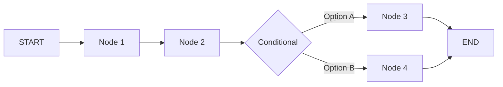

# مثال: فريق بحث وتحليل | Research Team Example

<div dir="rtl">

## نظرة عامة

هذا مثال عملي كامل لاستخدام قالب **Research & Analysis Team** لإجراء بحث شامل وكتابة تقرير تقني.

**المهمة**: البحث عن أحدث التطورات في LangGraph وكتابة مقال تقني شامل.

**الوقت المتوقع**: 5-7 دقائق

</div>

---

## Task Definition | تعريف المهمة

### Task Request

```json
{
  "task": "Research the latest developments in LangGraph (2024) and write a comprehensive technical article explaining its architecture, key features, and best practices",
  "requirements": {
    "length": "2500-3000 words",
    "tone": "technical but accessible",
    "target_audience": "intermediate to advanced developers",
    "include_code_examples": true,
    "include_diagrams": true,
    "cite_sources": true,
    "sections": [
      "Introduction",
      "Architecture Overview",
      "Key Features",
      "Execution Model",
      "Best Practices",
      "Code Examples",
      "Conclusion"
    ]
  },
  "constraints": {
    "deadline": "2024-02-25T23:59:59Z",
    "quality_level": "high"
  },
  "preferences": {
    "template_category": "research",
    "require_approval": true
  }
}
```

---

## Team Composition | تكوين الفريق

<div dir="rtl">

### الأدوار المخصصة

عند استخدام قالب **Research Team**، يتم تخصيص 4 أدوار:

</div>

### 1. Lead Researcher
**Model**: GPT-4o (OpenAI)
**Responsibilities**:
- Conduct comprehensive research on LangGraph
- Identify key concepts and features
- Gather code examples from official documentation
- Find recent updates and best practices

**Tools Assigned**:
- `tavily_search` - Web search
- `github_search` - Search LangGraph repository
- `web_scraper` - Extract content from documentation

**Skills Activated**:
- `research_methodology`
- `source_evaluation`
- `web_research`

---

### 2. Fact Checker
**Model**: Claude Opus 4 (Anthropic)
**Responsibilities**:
- Verify all facts and claims
- Evaluate source credibility
- Check code examples for correctness
- Ensure citations are accurate

**Tools Assigned**:
- `tavily_search` - Cross-reference facts
- `github_search` - Verify code examples

**Skills Activated**:
- `source_evaluation`
- `verification`

---

### 3. Technical Writer
**Model**: GPT-4o (OpenAI)
**Responsibilities**:
- Write comprehensive article
- Explain technical concepts clearly
- Structure content logically
- Create diagrams (Mermaid)

**Tools Assigned**:
- `mermaid_diagram` - Create diagrams
- `markdown_formatter` - Format content

**Skills Activated**:
- `technical_writing`
- `documentation`
- `communication`

---

### 4. Reviewer & Editor
**Model**: Claude Sonnet 4.5 (Anthropic)
**Responsibilities**:
- Review final article
- Check for clarity and coherence
- Ensure all requirements met
- Final quality check

**Tools Assigned**:
- None (pure review)

**Skills Activated**:
- `code_review` (adapted for content)
- `verification`

---

## Execution Flow | تدفق التنفيذ

### API Request

```bash
# 1. Login
TOKEN=$(curl -X POST http://localhost:4000/api/v1/auth/login \
  -H "Content-Type: application/json" \
  -d '{
    "email": "demo@example.com",
    "password": "demo123"
  }' | jq -r '.token')

# 2. Create draft
DRAFT=$(curl -X POST http://localhost:4000/api/v1/team/draft \
  -H "Authorization: Bearer $TOKEN" \
  -H "Content-Type: application/json" \
  -d '{
    "task": "Research the latest developments in LangGraph (2024) and write a comprehensive technical article",
    "requirements": {
      "length": "2500-3000 words",
      "tone": "technical but accessible",
      "include_code_examples": true,
      "include_diagrams": true,
      "cite_sources": true
    },
    "preferences": {
      "template_category": "research",
      "require_approval": true
    }
  }' | jq -r '.draft_id')

echo "Draft ID: $DRAFT"

# 3. Review draft (optional)
curl -X GET "http://localhost:4000/api/v1/team/draft/$DRAFT" \
  -H "Authorization: Bearer $TOKEN" \
  | jq '.'

# 4. Approve
curl -X POST http://localhost:4000/api/v1/team/approve \
  -H "Authorization: Bearer $TOKEN" \
  -H "Content-Type: application/json" \
  -d "{
    \"draft_id\": \"$DRAFT\",
    \"approved\": true,
    \"notes\": \"Looks good, proceed\"
  }"

# 5. Run
RUN=$(curl -X POST http://localhost:4000/api/v1/team/run \
  -H "Authorization: Bearer $TOKEN" \
  -H "Content-Type: application/json" \
  -d "{\"draft_id\": \"$DRAFT\"}" \
  | jq -r '.run_id')

echo "Run ID: $RUN"

# 6. Stream events (real-time)
curl -N "http://localhost:4000/api/v1/runs/$RUN/events" \
  -H "Authorization: Bearer $TOKEN" \
  -H "Accept: text/event-stream"
```

---

## Execution Timeline | الجدول الزمني

<div dir="rtl">

### المراحل المتوقعة

</div>

```
[00:00:00] intake           ✓ Task received and validated
[00:00:01] profile          ✓ Identified as: research, complexity: 65/100
[00:00:03] template_select  ✓ Selected: Research & Analysis Team v1
[00:00:04] team_design      ✓ Team: 4 roles (Lead Researcher, Fact Checker, Writer, Reviewer)
[00:00:05] model_route      ✓ Models: GPT-4o (2), Claude Opus 4 (1), Claude Sonnet 4.5 (1)
[00:00:06] tools_allocate   ✓ Tools: tavily_search, github_search, web_scraper, mermaid_diagram
[00:00:07] skills_load      ✓ Skills: research_methodology, source_evaluation, technical_writing
[00:00:08] approval_gate    ⏸️  PAUSED - Waiting for user approval
[00:02:30] approval_gate    ✓ APPROVED by user
[00:02:31] planner          ✓ Created 8-step execution plan
[00:02:38] specialists      🔄 Executing 4 specialists in parallel...

  [00:02:39] Lead Researcher   🔍 Researching LangGraph...
  [00:02:42]   ├─ Tool: tavily_search("LangGraph 2024 features")
  [00:02:45]   │   └─ Found 15 results
  [00:02:46]   ├─ Tool: github_search("langgraph", repo:"langchain-ai/langgraph")
  [00:02:50]   │   └─ Found 48 code examples
  [00:02:51]   ├─ Tool: web_scraper("https://langchain-ai.github.io/langgraph/")
  [00:02:58]   │   └─ Extracted 12 sections
  [00:03:20]   └─ ✓ Completed (output: 1850 tokens)

  [00:02:39] Fact Checker      ⏸️  Waiting for Lead Researcher...
  [00:03:21] Fact Checker      🔍 Verifying findings...
  [00:03:25]   ├─ Tool: tavily_search("LangGraph checkpoint persistence")
  [00:03:28]   │   └─ Verified: Correct
  [00:03:29]   ├─ Tool: github_search("StateGraph", repo:"langchain-ai/langgraph")
  [00:03:32]   │   └─ Code verified: Correct
  [00:03:45]   └─ ✓ Completed (verified: 18/18 facts)

  [00:03:46] Technical Writer  ✍️  Writing article...
  [00:04:05]   ├─ Section: Introduction (250 words)
  [00:04:28]   ├─ Section: Architecture Overview (450 words)
  [00:04:32]   ├─ Tool: mermaid_diagram(architecture flow)
  [00:04:34]   │   └─ Diagram created
  [00:04:55]   ├─ Section: Key Features (600 words)
  [00:05:20]   ├─ Section: Execution Model (550 words)
  [00:05:42]   ├─ Section: Best Practices (400 words)
  [00:06:05]   ├─ Section: Code Examples (300 words + code)
  [00:06:15]   ├─ Section: Conclusion (200 words)
  [00:06:25]   └─ ✓ Completed (output: 2850 words, 3 diagrams, 5 code examples)

  [00:06:26] Reviewer          📋 Reviewing article...
  [00:06:50]   ├─ Clarity: 95/100
  [00:06:51]   ├─ Technical accuracy: 98/100
  [00:06:52]   ├─ Completeness: 100/100 (all requirements met)
  [00:06:53]   ├─ Code examples: Correct
  [00:06:54]   ├─ Citations: 12 sources, all valid
  [00:06:55]   └─ ✓ Approved with minor suggestions

[00:06:56] tool_executor    ✓ All tools executed successfully (9 tool calls)
[00:06:57] aggregate        ✓ Combined outputs into coherent article
[00:06:58] verifier         ✓ Quality check: PASSED (no revision needed)
[00:06:59] finalizer        ✓ Article complete and formatted

✅ RUN COMPLETED in 4 minutes 29 seconds
```

---

## Output Example | مثال على النتيجة

<div dir="rtl">

### النتيجة النهائية

</div>

**File**: `langgraph-article-2024.md`

```markdown
# LangGraph: Modern Agent Orchestration Framework

*By Multi-Model Agent Teams Platform | February 24, 2024*

## Introduction

LangGraph has emerged as a powerful framework for building stateful,
multi-agent applications. Released by LangChain in 2024, it provides
developers with a robust toolkit for creating complex agent workflows
with built-in state management, checkpointing, and human-in-the-loop
capabilities.

Unlike traditional agent frameworks that rely on opaque "chains",
LangGraph introduces a graph-based paradigm where agents are nodes
and their interactions are edges. This approach offers unparalleled
visibility, control, and debuggability.

## Architecture Overview

LangGraph is built on three core concepts:

### 1. State Graphs

```python
from langgraph.graph import StateGraph

# Define state schema
class AgentState(TypedDict):
    messages: list[str]
    next_action: str

# Create graph
graph = StateGraph(AgentState)
```

State graphs are the foundation of LangGraph. Each node in the graph
receives the current state, performs operations, and returns updates
to be merged back into the state.



### 2. Checkpointing

One of LangGraph's standout features is automatic checkpointing:

```python
from langgraph.checkpoint.postgres import PostgresCheckpointer

# Configure checkpointer
checkpointer = PostgresCheckpointer(connection_string)

# Graph automatically saves state after each node
graph = StateGraph(AgentState, checkpointer=checkpointer)
```

Benefits:
- **Resume capability**: Continue from last successful node
- **Time travel**: Inspect state at any point in history
- **Debugging**: Step through execution node by node
- **Reliability**: Automatic recovery from failures

### 3. Human-in-the-Loop (HITL)

LangGraph natively supports human intervention:

```python
from langgraph.graph import interrupt

def approval_node(state):
    if requires_approval(state):
        # Pause execution, wait for human input
        return interrupt({"state": state})
    return state

graph.add_node("approval", approval_node)
```

## Key Features

### Parallel Execution

Execute multiple agents simultaneously:

```python
graph.add_node("research_1", research_agent_1)
graph.add_node("research_2", research_agent_2)
graph.add_node("research_3", research_agent_3)

# All run in parallel
graph.add_edge("start", ["research_1", "research_2", "research_3"])
graph.add_edge(["research_1", "research_2", "research_3"], "aggregate")
```

### Conditional Routing

Dynamic workflow based on state:

```python
def route_decision(state):
    if state["confidence"] > 0.9:
        return "finalize"
    elif state["attempts"] < 3:
        return "retry"
    else:
        return "escalate"

graph.add_conditional_edges(
    "decision",
    route_decision,
    {
        "finalize": "final_node",
        "retry": "retry_node",
        "escalate": "human_review"
    }
)
```

### Streaming Support

Stream partial results as they're generated:

```python
async for chunk in graph.astream(initial_state):
    print(f"Node: {chunk['node']}, State: {chunk['state']}")
```

## Execution Model

LangGraph follows a predictable execution model:

1. **Initialization**: Create graph with state schema
2. **Node Addition**: Add nodes (functions that process state)
3. **Edge Definition**: Define flow between nodes
4. **Compilation**: Compile graph into executable
5. **Invocation**: Run with initial state
6. **Checkpointing**: Automatic state saves after each node
7. **Completion**: Return final state

Key guarantees:
- ✅ Deterministic execution order
- ✅ Immutable state (updates via spreading)
- ✅ JSON-serializable state (for checkpointing)
- ✅ Atomic node execution
- ✅ Automatic retry with exponential backoff

## Best Practices

### 1. Design State Carefully

```python
# ❌ Bad: Mutable objects
class BadState(TypedDict):
    data: dict  # Can be mutated

# ✅ Good: Immutable, JSON-serializable
class GoodState(TypedDict):
    messages: list[str]
    count: int
    config: dict[str, str]
```

### 2. Keep Nodes Small

```python
# ❌ Bad: Monolithic node
def big_node(state):
    # 200 lines of code...
    return updated_state

# ✅ Good: Single responsibility
def validate_node(state):
    if not state["input"]:
        raise ValueError("Input required")
    return state

def process_node(state):
    result = process(state["input"])
    return {"result": result}
```

### 3. Use Conditional Edges for Branching

```python
# Prefer conditional edges over if/else in nodes
graph.add_conditional_edges(
    "decision",
    lambda s: "path_a" if s["score"] > 50 else "path_b"
)
```

### 4. Implement Proper Error Handling

```python
def safe_node(state):
    try:
        result = risky_operation(state)
        return {"result": result, "error": None}
    except Exception as e:
        return {"result": None, "error": str(e)}
```

### 5. Leverage Checkpointing

```python
# Always use checkpointing in production
graph = StateGraph(
    AgentState,
    checkpointer=PostgresCheckpointer(...)
)

# Resume from checkpoint
result = graph.invoke(
    initial_state,
    checkpoint_id=previous_checkpoint
)
```

## Code Examples

### Complete Agent Team Example

```python
from langgraph.graph import StateGraph, END
from langgraph.checkpoint.postgres import PostgresCheckpointer

class TeamState(TypedDict):
    task: str
    research_results: list[str]
    draft: str
    final_output: str
    revision_count: int

def researcher(state):
    results = conduct_research(state["task"])
    return {"research_results": results}

def writer(state):
    draft = write_draft(
        state["task"],
        state["research_results"]
    )
    return {"draft": draft}

def reviewer(state):
    if quality_check(state["draft"]):
        return {"final_output": state["draft"]}
    else:
        return {"revision_count": state["revision_count"] + 1}

def should_revise(state):
    if state.get("final_output"):
        return "end"
    elif state["revision_count"] < 2:
        return "writer"
    else:
        return "end"  # Max 2 revisions

# Build graph
graph = StateGraph(
    TeamState,
    checkpointer=PostgresCheckpointer(DB_URL)
)

graph.add_node("researcher", researcher)
graph.add_node("writer", writer)
graph.add_node("reviewer", reviewer)

graph.add_edge("researcher", "writer")
graph.add_edge("writer", "reviewer")
graph.add_conditional_edges(
    "reviewer",
    should_revise,
    {
        "writer": "writer",
        "end": END
    }
)

graph.set_entry_point("researcher")

# Compile and run
app = graph.compile()
result = app.invoke({
    "task": "Write about LangGraph",
    "revision_count": 0
})

print(result["final_output"])
```

## Conclusion

LangGraph represents a significant evolution in agent orchestration.
By providing a graph-based paradigm with built-in state management,
checkpointing, and human-in-the-loop capabilities, it enables
developers to build production-ready multi-agent systems with
confidence.

Key takeaways:
- ✅ Graph-based architecture for clarity and control
- ✅ Automatic checkpointing for reliability
- ✅ Native HITL support for governance
- ✅ Parallel execution for performance
- ✅ Conditional routing for dynamic workflows

Whether you're building a simple research agent or a complex
multi-agent system, LangGraph provides the tools you need to
succeed.

## References

1. LangGraph Documentation: https://langchain-ai.github.io/langgraph/
2. GitHub Repository: https://github.com/langchain-ai/langgraph
3. LangChain Blog: "Introducing LangGraph" (2024)
4. LangSmith Tracing Guide
5. State Machines in Agent Systems (Research Paper, 2024)
6. Checkpoint Persistence Patterns (Blog Post, 2024)
7. Production Agent Deployment Guide
8. Human-in-the-Loop Best Practices
9. Parallel Agent Execution Strategies
10. Error Handling in Distributed Systems
11. Graph Theory for AI Agents
12. LangGraph vs Traditional Chains (Comparison, 2024)

---

*Generated by Multi-Model Agent Teams Platform*
*Lead Researcher: GPT-4o | Fact Checker: Claude Opus 4 | Writer: GPT-4o | Reviewer: Claude Sonnet 4.5*
*Execution Time: 4 minutes 29 seconds | Total Tokens: 8,450*
```

---

## Artifacts Generated | المخرجات

<div dir="rtl">

### الملفات المحفوظة

</div>

1. **Main Article**: `langgraph-article-2024.md` (2,850 words)
2. **Architecture Diagram**: `langgraph-architecture.svg` (Mermaid)
3. **Execution Flow Diagram**: `langgraph-execution.svg`
4. **State Graph Example**: `langgraph-state-graph.svg`
5. **Sources List**: `research-sources.json` (12 sources)
6. **Code Examples**: `examples/` folder (5 Python files)

---

## Metrics | المقاييس

```json
{
  "execution": {
    "total_duration_ms": 269000,
    "duration_per_node": {
      "intake": 1000,
      "profile": 2000,
      "template_select": 1000,
      "team_design": 1000,
      "model_route": 1000,
      "tools_allocate": 1000,
      "skills_load": 1000,
      "approval_gate": 143000,
      "planner": 7000,
      "specialists_parallel": 238000,
      "tool_executor": 1000,
      "aggregate": 1000,
      "verifier": 1000,
      "finalizer": 1000
    }
  },
  "models": {
    "total_calls": 12,
    "by_model": {
      "gpt-4o": 6,
      "claude-opus-4": 3,
      "claude-sonnet-4.5": 3
    },
    "total_tokens": 8450,
    "by_model_tokens": {
      "gpt-4o": 5200,
      "claude-opus-4": 1850,
      "claude-sonnet-4.5": 1400
    }
  },
  "tools": {
    "total_calls": 9,
    "by_tool": {
      "tavily_search": 3,
      "github_search": 3,
      "web_scraper": 1,
      "mermaid_diagram": 2
    },
    "success_rate": 100
  },
  "quality": {
    "verification_status": "passed",
    "revision_count": 0,
    "final_word_count": 2850,
    "code_examples_count": 5,
    "diagrams_count": 3,
    "sources_cited": 12
  }
}
```

---

## Lessons Learned | الدروس المستفادة

<div dir="rtl">

### نصائح للحصول على أفضل النتائج

</div>

### 1. Be Specific in Task Description
**❌ Vague**: "Write about LangGraph"
**✅ Clear**: "Research LangGraph 2024 features and write 2500-word technical article with code examples, diagrams, and citations"

### 2. Set Clear Requirements
Include:
- Target word count
- Tone and audience
- Required sections
- Output format (Markdown, HTML, PDF)
- Code examples needed (yes/no)
- Citations needed (yes/no)

### 3. Use Approval Mode for Important Tasks
- Enables review before execution
- Prevents wasted tokens on wrong direction
- Allows adjustments to team composition

### 4. Monitor Progress via SSE
```bash
curl -N http://localhost:4000/api/v1/runs/$RUN_ID/events \
  -H "Authorization: Bearer $TOKEN" \
  | jq -r '.data'
```

### 5. Trust the Verifier
- Verifier node ensures quality
- Maximum 2 revision loops prevents infinite loops
- If verifier fails twice, review task requirements

---

## Variations | تنويعات

<div dir="rtl">

### أنواع مختلفة من المهام البحثية

</div>

### Quick Summary (1000 words)
```json
{
  "task": "Quick summary of LangGraph key features",
  "requirements": {
    "length": "800-1000 words",
    "tone": "accessible",
    "include_code_examples": false
  }
}
```
**Expected Time**: 2-3 minutes

---

### Deep Dive (5000+ words)
```json
{
  "task": "Comprehensive research report on LangGraph",
  "requirements": {
    "length": "5000-6000 words",
    "depth": "extensive",
    "include_code_examples": true,
    "include_diagrams": true,
    "academic_style": true,
    "minimum_sources": 20
  }
}
```
**Expected Time**: 10-15 minutes

---

### Comparison Article
```json
{
  "task": "Compare LangGraph vs LangChain chains vs CrewAI",
  "requirements": {
    "length": "3000 words",
    "comparison_table": true,
    "pros_cons_each": true,
    "use_case_recommendations": true
  }
}
```
**Expected Time**: 7-10 minutes

---

## Troubleshooting | حل المشاكل

<div dir="rtl">

### مشاكل شائعة

</div>

### Issue: Run stuck at "specialists_parallel"

**Cause**: Tool execution timeout or API rate limit

**Solution**:
```bash
# Check logs
curl http://localhost:4000/api/v1/runs/$RUN_ID \
  | jq '.execution_trace | .[] | select(.status == "failed")'

# If timeout, increase in .env
TOOL_EXECUTION_TIMEOUT=120000  # 2 minutes
```

---

### Issue: Verifier keeps failing (2 loops)

**Cause**: Requirements too strict or unclear

**Solution**:
1. Review original task requirements
2. Simplify requirements
3. Be more specific about success criteria
4. Check if code examples are running correctly

---

### Issue: Low-quality output

**Solutions**:
1. Use more specific requirements
2. Increase word count target
3. Require code examples and diagrams
4. Specify tone and audience clearly
5. Add domain-specific constraints

---

## Next Steps | الخطوات التالية

<div dir="rtl">

### تعلم المزيد

</div>

- [Coding Team Example](CODING_TEAM.md) - Code review and development
- [Content Team Example](CONTENT_TEAM.md) - Blog posts and documentation
- [Custom Template](CUSTOM_TEMPLATE.md) - Create your own template
- [API Reference](../api/REST_API.md) - Full API documentation

---

<div align="center" dir="rtl">

**مثال كامل - Research Team**

**استخدم نفس الطريقة لأي مهمة بحثية!**

</div>
